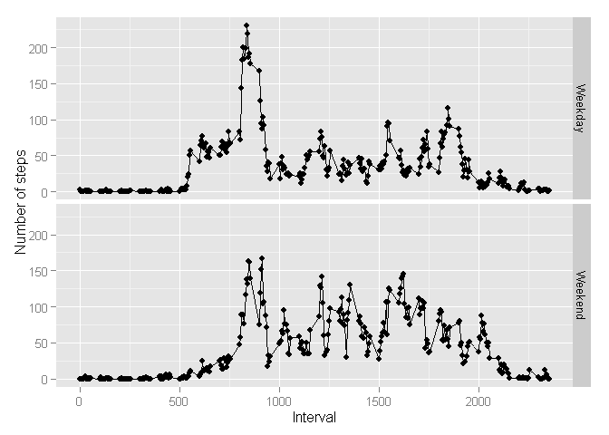

# Reproducible Research: Peer Assessment 1


## Loading and preprocessing the data
1. Load the data 

```r
origdata<-read.csv("activity/activity.csv")
```
2. Process/transform the data (if necessary) into a format suitable for your analysis

```r
origdata$date<-as.Date(origdata$date)
data<-origdata[!is.na(origdata$steps),]
```
## What is mean total number of steps taken per day?
1. Calculate the total number of steps taken per day

```r
stepsum<-aggregate(data$steps,by=list(date=data$date),sum)
colnames(stepsum)[2]<-"TotalSteps"
```
2. Make a histogram of the total number of steps taken each day

```r
hist(stepsum$TotalSteps)
```

 

3. Calculate and report the mean and median of the total number of steps taken per day

```r
mean<-mean(stepsum$TotalSteps)
median<-median(stepsum$TotalSteps)
```
*The mean of the total number of steps taken per day is: 1.0766189\times 10^{4}*  
*The median of the total number of steps taken per day is: 10765*

## What is the average daily activity pattern?
1. Make a time series plot (i.e. type = "l") of the 5-minute interval (x-axis) and the average number of steps taken, averaged across all days (y-axis)

```r
stepavg<-aggregate(data$steps,by=list(interval=data$interval),mean)
plot(stepavg$interval, stepavg$x, type="l", main="Average Daily Steps")
```

 

2. Which 5-minute interval, on average across all the days in the dataset, contains the maximum number of steps?

```r
maxinterval<-stepavg[stepavg$x>200,]
```
*The interval containing the maximum number of steps is: 835*

## Imputing missing values
1. Calculate and report the total number of missing values in the dataset (i.e. the total number of 
rows with NAs)

```r
nadata<-origdata[is.na(origdata$steps),]
numberOfMissingValue<-nrow(nadata)
```
*The total number of missing values in the dataset is 2304*

2. Devise a strategy for filling in all of the missing values in the dataset. The strategy does not need to be sophisticated. For example, you could use the mean/median for that day, or the mean for that 5-minute interval, etc.

*Fill in the missing values with the mean for the 5-minute interval*

```r
mergeddata<-merge(origdata,stepavg,by="interval")
mergeddata$newsteps<-ifelse(is.na(mergeddata$steps),mergeddata$x, mergeddata$steps)
```

3. Create a new dataset that is equal to the original dataset but with the missing data filled in.

```r
newdata<-mergeddata[,c('date','interval','newsteps')]
colnames(newdata)[3]<-"steps"
```
4. Make a histogram of the total number of steps taken each day and Calculate and report the mean and median total number of steps taken per day. Do these values differ from the estimates from the first part of the assignment? What is the impact of inputing missing data on the estimates of the total daily number of steps?


```r
newstepsum<-aggregate(newdata$steps,by=list(date=newdata$date),sum)
colnames(newstepsum)[2]<-"TotalSteps"
hist(newstepsum$TotalSteps)
```

 

```r
mean(newstepsum$TotalSteps)
```

```
## [1] 10766.19
```

```r
median(newstepsum$TotalSteps)
```

```
## [1] 10766.19
```
*Yes, the frequency of total number of steps per day of between 10000 and 15000 increases and the median increases to be the same value as the mean, although the mean is the same*

## Are there differences in activity patterns between weekdays and weekends?
1. Create a new factor variable in the dataset with two levels - "weekday" and "weekend" indicating whether a given date is a weekday or weekend day.

```r
newdata$weekday<-weekdays(newdata$date)
newdata$weekdayOrWeekend<-ifelse(newdata$weekday %in% c("Saturday","Sunday"),"Weekend", "Weekday")
```

2. Make a panel plot containing a time series plot (i.e. type = "l") of the 5-minute interval (x-axis) and the average number of steps taken, averaged across all weekday days or weekend days (y-axis). See the README file in the GitHub repository to see an example of what this plot should look like using simulated data.


```r
require(ggplot2)
```

```
## Loading required package: ggplot2
```

```
## Warning: package 'ggplot2' was built under R version 3.2.1
```

```r
weekdayData<-newdata[newdata$weekdayOrWeekend=="Weekday",]
avgWeekdaysteps<-aggregate(weekdayData$steps,by=list(interval=weekdayData$interval),mean)
avgWeekdaysteps$daytype<-"Weekday"

weekendData<-newdata[newdata$weekdayOrWeekend=="Weekend",]
avgWeekendsteps<-aggregate(weekendData$steps,by=list(interval=weekendData$interval),mean)
avgWeekendsteps$daytype<-"Weekend"

avgSteps<-merge(avgWeekdaysteps,avgWeekendsteps, all.x=TRUE, all.y=TRUE)
colnames(avgSteps)[2] <- "average_steps"

qplot(interval, average_steps, data = avgSteps, xlab="Interval", ylab="Number of steps") + geom_line()+ facet_grid(daytype~.)
```

 
